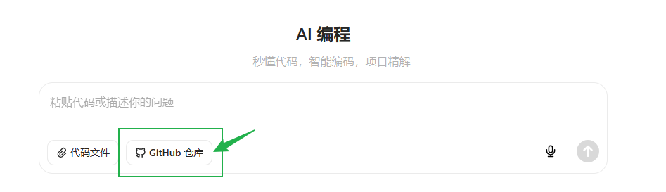

# AI Dialogue Large Model Generates pbottleRPA Flow Scripts

Thanks to the open-source and open policy of the pbottleRPA script layer, pbottleRPA can easily leverage mainstream AI programming assistants to quickly generate high-quality flow scripts.

This feature is currently for reference and testing purposes only.

## pbottleRPA Assistant Agent

Directly access the pbottleRPA assistant agent: (official knowledge base has been updated)

https://yuanqi.tencent.com/webim/#/chat/yoxhoN?appid=2021155473084382336

```
https://yuanqi.tencent.com/webim/#/chat/yoxhoN?appid=2021155473084382336
```


## AI Platform (beta)

#### Open AI Platform

Using Doubao Programming Assistant as an example

https://www.doubao.com/


#### Import pbottleRPA Open Source Library

- Click the bottom "Programming" -> "Import Open Source Repository"



- Copy the address below, input and confirm
  
```
https://github.com/leoxiaoping/pbottleRPA
```


#### Start a Conversation

Enter a conversation question to test

```
Generate a JS flow script: Open multiple URLs and bookmark them with ctrl+d
```
