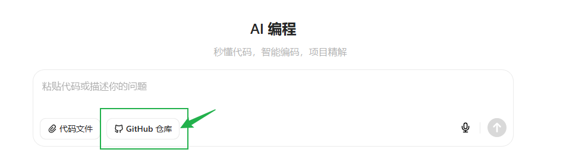

# AI 对话大模型 生成小瓶RPA流程脚本

得益于小瓶RPA脚本层开源开放政策，小瓶RPA能够轻松用主流AI编程助手快速生成高质量流程脚本。

此功能目前只做参考和测试用途。

## 小瓶RPA助手智能体


直接访问小瓶RPA助手智能体agent：（官方知识库已经更新）

https://yuanqi.tencent.com/webim/#/chat/yoxhoN?appid=2021155473084382336

```
https://yuanqi.tencent.com/webim/#/chat/yoxhoN?appid=2021155473084382336
```


## AI平台（beta）

#### 打开AI平台

以豆包编程助手为例

https://www.doubao.com/


#### 引入小瓶RPA开源库

- 点击底部编程-》引入开源仓库



- 复制下面地址，输入并确认
  
```
https://github.com/leoxiaoping/pbottleRPA
```


#### 开始对话

输入对话提问例子测试

```
生成js流程脚本：打开多个网址并按 ctrl+d 收藏这些网址
```

