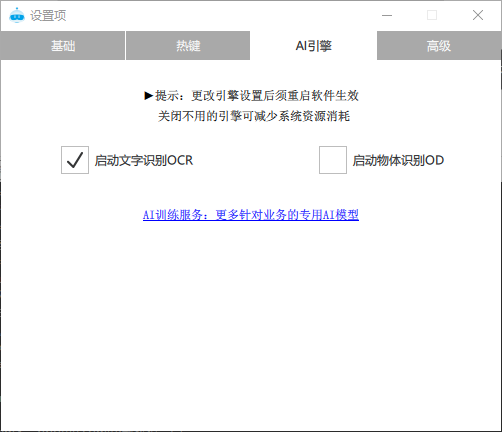

# 本地 AI 图像

首先在软件设置中开启本地AI识别功能模块，然后重启软件生效。

## aiOcr 文字识别

@param {string} imagePath 空或者screen 为电脑屏幕; 或者本地图片的绝对路径;

@param {number} x 可选 剪裁起始点 左上角开始

@param {number} y 可选 剪裁起始点

@param {number} width 可选 剪裁宽度

@param {number} height 可选 剪裁高度

@returns {array} AI OCR识别的json结果 包含准确率的评分和中点位置 格式： `[{text:'A',score:'0.319415',x:100,y:200},...]`

##  findText 寻找文字

findText 屏幕查找定位文字

查找文字，注：此功能受电脑性能影响，低配电脑可能速度较慢。 需要小瓶RPA客户端版本 > V2024.5

@param {string} inputTxt

@param {number} fromX=0 可选，查找开始的开始横坐标

@param {number} fromY=0 可选，查找开始的开始纵坐标

@param {number} width=-1 可选，搜索宽度

@param {number} height=-1 可选，搜索高度

@returns {JSON} 返回json结果：{x,y,text} x,y坐标相对于fromX，fromY。

## aiObject 物体识别

AI 物体识别 已经从经典算法升级为AI模型预测，企业版可脱网使用 V2024.8 以上版本有效

调试：软件根目录会生成 debug/Ai_ObjectDetect.png 文件

@param {number} imagePath 空或者screen 为电脑屏幕; 或者本地图片的绝对路径;

@param {number} x 可选 剪裁起始点 左上角开始

@param {number} y 可选 剪裁起始点

@param {number} width 可选 剪裁宽度

@param {number} height 可选 剪裁高度

@returns {array} AI 物体识别的 json 结果 包含准确率的评分 格式： `[{x:100,y:100,width:150,height:150,score:0.86,class:'分类名'},...]`

