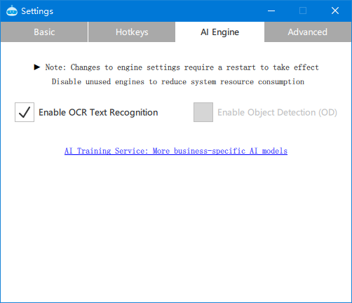

# Local AI Image

First, enable the local AI recognition feature module in the software settings, then restart the software to take effect.

## aiOcr Text Recognition

@param {string} imagePath empty or "screen" for the computer screen; or absolute path to a local image

@param {number} x optional, crop start point, starting from top-left corner

@param {number} y optional, crop start point

@param {number} width optional, crop width

@param {number} height optional, crop height

@returns {array} AI OCR recognition JSON results with confidence score and center position format: `[{text:'A',score:'0.319415',x:100,y:200},...]`

## findText Find Text

findText searches and locates text on the screen

Note: performance depends on computer specs; may be slow on low-end machines. Requires pbottle RPA client version > V2024.5

@param {string} inputTxt

@param {number} fromX=0 optional, search start X coordinate

@param {number} fromY=0 optional, search start Y coordinate

@param {number} width=-1 optional, search width

@param {number} height=-1 optional, search height

@returns {JSON} returns JSON result: {x,y,text} x,y coordinates relative to fromX, fromY.

## aiObject Object Detection

AI object detection has been upgraded from classic algorithms to AI model prediction, Enterprise Edition can work offline. Effective for versions >= V2024.8

Debug: a debug/Ai_ObjectDetect.png file will be generated in the software root directory

@param {number} imagePath empty or "screen" for the computer screen; or absolute path to a local image

@param {number} x optional, crop start point, starting from top-left corner

@param {number} y optional, crop start point

@param {number} width optional, crop width

@param {number} height optional, crop height

@returns {array} AI object detection JSON results with confidence score Format: `[{x:100,y:100,width:150,height:150,score:0.86,class:'class name'},...]`

