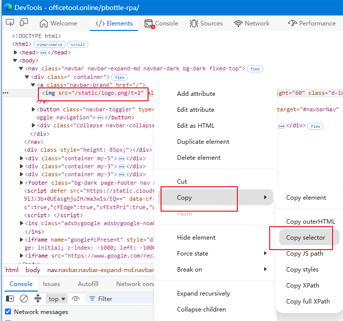

# Browser Enhancement - Web Application

**⚠ The browser plugin is just a quick shortcut for web browser page operations, it is not mandatory. Desktop application operation rules can also be used to operate web browser applications.**

Requires prior installation of the pbottleRPA browser extension. Installation instructions:

https://officetool.online/a-313.html


Basic usage:
`pbottleRPA.browserCMD.xxx()`

Refer to demo examples starting with "web enhancement".

## Element Selector


pbottleRPA web enhancement basically follows the design rules of the widely used **jQuery selector**. Refer to the jQuery selector documentation.

https://api.jquery.com/category/selectors/

Advantages over xpath and other solutions:

- Low learning curve, rules consistent with the browser's native document.querySelector method
- Strong compatibility, supports virtual DOM front-end frameworks such as Vue, React, etc.
- Rich and powerful pseudo-class support for advanced selection and positioning

```javascript
pbottleRPA.browserCMD_click('button:contains(Login)')
```


## Element Selector Testing Tool

The new version of pbottleRPA includes an element selector testing feature. This feature helps users quickly locate and select HTML elements in complex web pages.


**V2025.2 New: Selected element background flash feature to help users view element positions.**


Quick copy element selector steps:

1. Hover the mouse over the target element on the page, press F12 or right-click "Inspect Element"
2. On the target element's code block, right-click to open the copy menu
3. Select "Copy selector"




## alert Dialog


browserCMD_alert()

Browser enhanced command. Requires pbottleRPA browser extension.

Alert dialog.

@param {*} msg text content to display

@returns none


## url Get/Set Current URL

browserCMD_url()

Browser enhanced command. Requires pbottleRPA browser extension.

@param {string} urlStr redirect current page to a new URL, default empty to get current URL. [Effective for pbottleRPA browser extension V2023.8+]

@returns {string} returns current browser URL or ok


## click Click

browserCMD_click()

Browser enhanced command. Requires pbottleRPA browser extension.

Simulate click. Refer to jQuery click() method, changed to browser native click() with auto-focus.

@param {string} selector   element selector. If multiple elements match, only the first element's click event is triggered.

@param {object} options click options  optional  e.g.: { bubbles: false, ctrlKey: true} https://developer.mozilla.org/en-US/docs/Web/API/MouseEvent/MouseEvent

@returns {string}


## dblclick Double Click

Browser enhanced command. Requires pbottleRPA browser extension. Supported from V2026.2+.

Simulate double click. Refer to jQuery dblclick() method, changed to browser native click() with auto-focus.

@param {string} selector   element selector. If multiple elements match, only the first element's click event is triggered.

@param {object} options click options  optional  e.g.: { bubbles: false, ctrlKey: true} https://developer.mozilla.org/en-US/docs/Web/API/MouseEvent/MouseEvent

@returns {string}


## closeTab Close Tab

browserCMD_closeTab('current'|'other')  Supported from V2025.4+.

Browser enhanced command. Requires pbottleRPA browser extension.

Close browser tab. Use pbottleRPA.openURL() to open new tabs.

@param {string} close type  'current': default close current tab; 'other': close other tabs

@returns {string} normally returns 'ok'


## count Element Count

browserCMD_count()

Browser enhanced command. Requires pbottleRPA browser extension.

Element count. Refer to jQuery selector.

@param {string} selector element selector

@returns {number} returns the count of selected elements, the optimal result is 1

## hide Hide Element

browserCMD_hide()

Browser enhanced command. Requires pbottleRPA browser extension.

Hide. Refer to jQuery hide() method.

@param {*} selector element selector

@returns


## show Show Element

browserCMD_show()

Browser enhanced command. Requires pbottleRPA browser extension.

Show. Refer to jQuery show() method.

@param {*} selector element selector

@returns


## offset Get Element Position

Browser enhanced command. Requires pbottleRPA browser extension. Effective for versions >= 2024.0.

Get element position relative to browser document top-left. Refer to jQuery offset() method.

@param {string} selector element selector

@returns {} returns JSON: `{"top":100,"left":100}`  Pixel values are software pixels, not hardware pixels.


## remove Remove Element

browserCMD_remove()

Browser enhanced command. Requires pbottleRPA browser extension.

Remove element. Refer to jQuery remove() method.

@param {*} selector element selector

## text Get/Set Text

browserCMD_text

Browser enhanced command. Requires pbottleRPA browser extension.

Get or set text. Refer to jQuery text() method.

@param {*} selector element selector

@param {*} content

@returns

## html Set/Get Code

browserCMD_html()

Browser enhanced command. Requires pbottleRPA browser extension.

Get or set HTML. Refer to jQuery html() method.

@param {*} selector element selector

@param {*} content

@returns

## val Get/Set Value

browserCMD_val()

Browser enhanced command. Requires pbottleRPA browser extension.

Get or set value for input, select, etc. Refer to jQuery val() method.

@param {*} selector element selector

@param {*} content

@returns

## cookie Get/Set Small Storage

browserCMD_cookie()

Browser enhanced command. Requires pbottleRPA browser extension.

Get or set the current site's cookie.

@param {*} cName cookie name

@param {*} cValue cookie value, leave empty to get the cookie value

@param {*} expDays cookie expiration time in days, leave empty for session cookie

@returns cookie value


## css Get/Set Style

browserCMD_css()

Browser enhanced command. Requires pbottleRPA browser extension.

Get or set CSS style. Refer to jQuery css() method.

@param {*} selector element selector

@param {*} propertyname

@param {*} value

@returns


## attr Get/Set Attribute

Browser enhanced command. Requires pbottleRPA browser extension.

Get or set attr attribute. Refer to jQuery attr() method.

@param {*} selector element selector

@param {*} attribute name

@param {*} value


## prop Get/Set Prop

Browser enhanced command. Requires pbottleRPA browser extension.

Get or set prop attribute. Refer to jQuery prop() method.

@param {*} selector element selector

@param {*} attribute name

@param {*} value

## fetch Network Request

Browser enhanced command. Requires pbottleRPA browser extension. Supported from V2026.2+.

Fetch request, initiates an AJAX request from the current page and returns the response. https://developer.mozilla.org/en-US/docs/Web/API/Fetch_API/Using_Fetch

Default 20 seconds timeout.

@param {string} fetch_url URL

@param {object} options request parameters

@returns {string} response result

## waitPageReady Monitor Page Load Complete

Browser enhanced command. Requires pbottleRPA browser extension. Supported from V2026.2+.

Wait for page to finish loading, returns the page URL.

Default 20 seconds timeout.

@param {string} readyURL  the URL expected after page loading completes

@param {number} timeout timeout in seconds

@returns {string}  returns current browser URL or error exit


## Batch Scrape Web Content

When the selector returns multiple elements, all content is returned at once in JSON array format. Note: Supported from V2025.3+.

Batch scraping currently supports the following methods:

- text()
- html()
- val()
- attr()
  
  See demo: WEB Enhancement - Batch Data Scraping Demo.js
