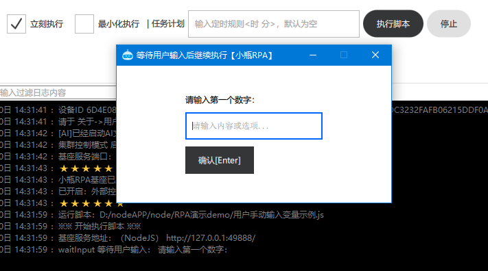

# 用户输入

小瓶RPA流程执行中，流程可以暂停等待用户可以手动输入数值或者选项。

输入后流程继续执行。

⚠ V2026.0 以上版本基座支持用户输入。

## 等待输入 waitInput

 * 等待输入 V2026.0.0 新增
 * @param {string} inputPrompt 输入提示词
 * @param {number} timeOut 可选，等待超时时间 单位秒 默认600秒
 * @returns {string}  输入内容  默认返回空字符串

### 图片预览

### demo示例

用户手动输入变量示例.js

