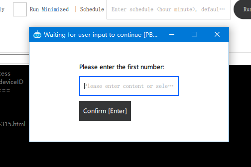

# User Input

During pbottleRPA flow execution, the flow can pause and wait for the user to manually input values or select options.

After input, the flow continues execution.

⚠ The base platform supports user input from V2026.0+.

## waitInput Wait for Input

 * Wait for input. Added in V2026.0.0.
 * @param {string} inputPrompt input prompt text
 * @param {number} timeOut optional, wait timeout in seconds, default 600 seconds
 * @returns {string}  input content, default returns empty string

### Preview

### Demo Example

User Manual Input Variable Example.js

