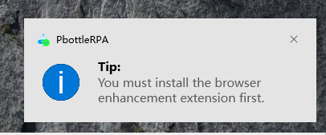

# System Related

## wait | Wait

  Pause script and wait for operation response (seconds).
  Note: waiting over 100s will log a reminder.
  @param {number} seconds  seconds, default 1 second. Supports decimals.

## setDefaultDelay | Set Default Operation Delay

Set the delay for RPA simulation operations. Includes mouse, keyboard, paste, and open URL actions.
Set to 0 to manually manage operation delays with sleep().

@param {*} millisecond delay in milliseconds


## jsPath | Directory Path

Variable name:
Current script's folder path, without trailing slash.

Alias: __dirname for convenience in .mjs usage.

## getBasePath | Base Path

Get and set the base platform root directory path. Enabled from V2025.0+.

@returns {string}

## showMsg | Display System Message

@param {*} title title
@param {*} content content

This message dialog is a native operating system dialog.



💡 Turn on the notification toggle for pbottleRPA in System Settings.


## showRect | Display Marked Rectangle

Display a colored rectangle on the visible screen for intuitive visual feedback of the operation range and current target position.
Effective for versions >= V2024.6.

@param {number} fromX starting X coordinate, origin at top-left of screen

@param {number} fromY

@param {number} width width

@param {number} height height

@param {string} color color: red|green|blue|yellow

@param {number} msec display duration in milliseconds

Example script: Moments Likes, Screenshot, Text Recognition

## openFile | Open File

Open a file with its default application, such as Word, Excel, PDF, etc.

@param {*} path file path

## openDir | Open Directory

Show a folder in File Explorer.

@param {*} path folder path

## kill | Close Application

(Force) close a specified application.

@param {string} processName process name, e.g.: 'WINWORD.EXE' as shown in Task Manager 'Process Name' column. Note: not the display name; if not visible, right-click and enable this column.

@param {boolean} force whether to force close, equivalent to simulating Task Manager's End Task. Default is normal close, which may prompt a save confirmation dialog.

```javascript
pbottleRPA.kill('WINWORD.EXE')  // close Word
pbottleRPA.kill('EXCEL.EXE')  // close Excel
pbottleRPA.kill('msedge.exe')  // close Edge browser
```


## copyText | Copy Text

Simulate copying text, equivalent to selecting and copying text content.

@param {string} txt text content to copy

## copyFile | Copy File

Simulate copy file operation, supports file paths and folder paths. After copying, Ctrl+V in target folder to paste. Effective from V2024.7.

After copying a file, you can paste it in WeChat send window to send the file.

@param {string} filepath absolute path

## exit | Exit Flow

Force exit the current script.

@param {string} msg message to output on exit

## log | Log Output

@param {string} text output log


## waitFile | Wait for File

Wait for a file to be downloaded or generated.

@param {string} dirPath monitored directory, e.g.: 'c:/User/pbottle/download'

@param {string} keyWords filter keywords, e.g.: '.zip'

@param {function} intervalFun operation to run between checks, function format

@param {number} timeOut wait timeout in seconds
