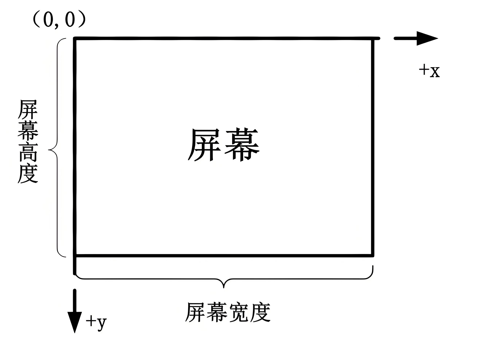

# API统一规范定义

## 屏幕坐标

以屏幕左上角为原点（坐标为 (0, 0)），水平向右为 x 轴正方向，垂直向下为 y 轴正方向。在这种坐标系中，屏幕上任意一点都可以通过一个 (x, y) 的坐标值来表示，其中 x 表示该点距离原点在水平方向的距离，y 表示在垂直方向的距离，单位通常是像素。

注意：在有缩放的屏幕上时，其中的像素单位是**物理像素**，不是软件像素。

#### 推荐截图和测量工具

snipaste 截图软件自带坐标测量。

下载地址：
https://zh.snipaste.com/download.html

#### 分辨率测量工具

[https://www.pbottle.com/a-13812.html](https://www.pbottle.com/a-13812.html)

## 统一路径格式

小瓶RPA脚本默认路径格式分隔符为 `/`，包含 windows 系统。

windows 系统路径规则统一到 Linux 系统路径规则。

举例：

1. 绝对路径  `D:/myPath/test.png`
2. 相对路径  `./test.png`