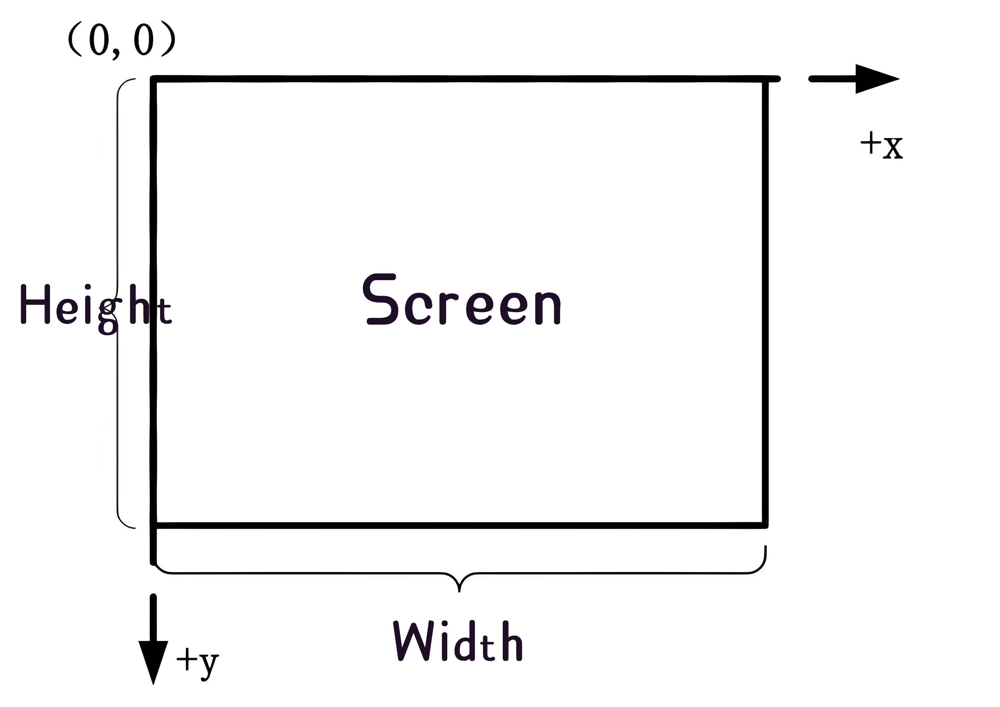

# API Unified Specification

## Screen Coordinates

The top-left corner of the screen is the origin (coordinates (0, 0)). The positive x-axis goes horizontally to the right, and the positive y-axis goes vertically downward. In this coordinate system, any point on the screen can be represented by an (x, y) coordinate, where x is the horizontal distance from the origin and y is the vertical distance, usually in pixels.

Note: On screens with scaling, the pixel unit is **physical pixels**, not software pixels.

#### Recommended Screenshot and Measurement Tools

Snipaste screenshot software includes coordinate measurement.

Download:
https://www.snipaste.com/index.html

#### Resolution Measurement Tool

https://officetool.online/screen-resolution/

## Unified Path Format

The default path separator for pbottleRPA scripts is `/`, including on Windows systems.

Windows system path rules are unified with Linux system path rules.

Examples:

1. Absolute path  `D:/myPath/test.png`
2. Relative path  `./test.png`
