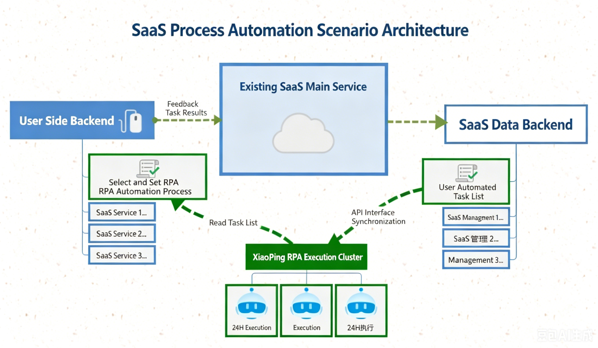

# SaaS System Automation Tasks

pbottleRPA can serve existing SaaS systems by providing an automated task service center upgrade.

## Advantages

- Seamless platform upgrade for SaaS systems
- Maintain SaaS brand user experience
- Local batch centralized execution, low cost
- Expand existing SaaS automation task capabilities

## Architecture Diagram

