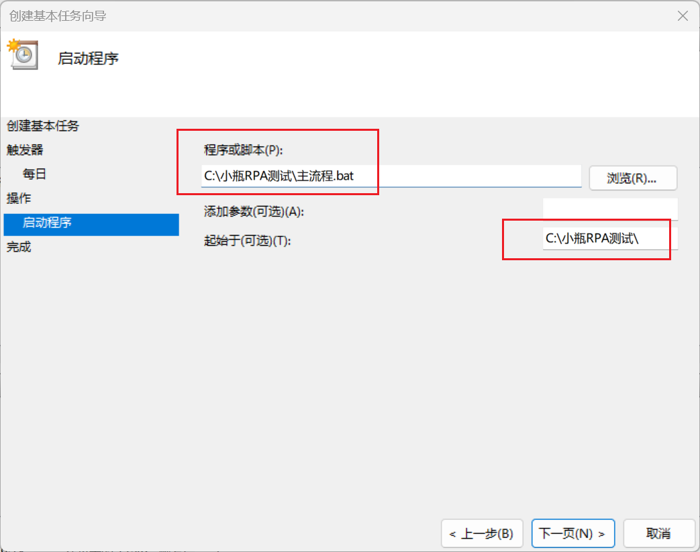

# 定时启动计划任务

## 小瓶RPA自带定时任务规则

计划任务设置规则

1. 小时字段和分钟字段用空格隔开
2. 多个值用逗号隔开
3. 小时的取值范围 0-23，分钟取值范围0-59 
4. 支持  -   表示范围，支持  *  表示任意


例子：

```
* *           //表示每分钟一次
0-9  0        //表示每天0点 ...  到9点  9个小时每小时的零分钟都运营一次
3,6,9  10,40  //表示每天3点，6点，9点， 每小时运行两次，分别在10分钟和40分钟
```


## windows 高级多任务定时任务

操作系统原生定时器，稳定高效，并且有睡眠唤醒等高级功能

- Windows ：**任务计划程序**

1. 打开windows自带的计划任务程序，并设置触发时间


2. 设置小瓶RPA启动流程




详细：
https://rpa.pbottle.com/a-13985.html


## Linux  多任务定时任务

Linux **crontab** 是 Linux 系统中用于设置周期性被执行的指令的命令。

当安装完成操作系统之后，默认便会启动此任务调度命令。

crond 命令每分钟会定期检查是否有要执行的工作，如果有要执行的工作便会自动执行该工作。

Cron 表达式在线工具：https://www.jyshare.com/front-end/9444/
