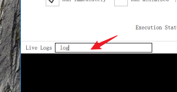

# Flow Running Logs

pbottleRPA has both real-time logs and persistent hard disk logs.

**New version supports: each flow generates an independent log file, forming a clear running record.**

## Real-Time Running Logs

The pbottleRPA flow log system directly captures the standard output of the script engine and automatically appends the current detailed time:

1. JavaScript users
   
`console.log('Flow log output')`

2. Python users
   
`print('Flow log output')`

### Example

## Persistent Hard Disk Logs

How to view:

- Menu: Tools -> View Running Logs

## Complete Flow Running History [Logs Files]

- Each flow generates an independent log file, forming a clear running record.
- A file directory is created for each day, making it easy to search history records by date.
