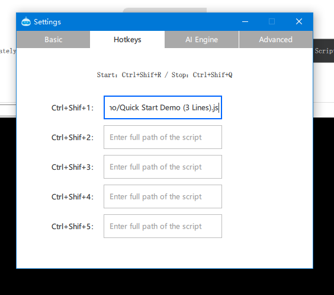

# Hotkeys and Shortcuts

Convenient for users to quickly start existing task flows, combining manual and automatic operations to expand more application scenarios.

For example, automatic login, automatic data processing, etc., making pbottleRPA truly your office assistant.

## Global Flow Task Hotkeys

#### Ctrl + Shift + Q

Stop the current script execution & end the current mouse operation recording.

#### Ctrl + Shift + R

Restart the current script execution.

## Task Shortcuts

#### Settings

#### Ctrl + Shift + Number (1-5)

Global hotkeys for quick tasks.

## Taskbar Menu Quick Launch

Display in the taskbar menu, right-click to expand quick items, click to execute quickly.

