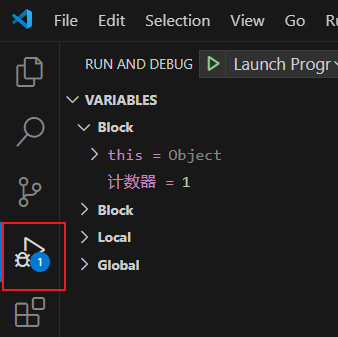

# 用 js 脚本开发自动化流程 

JavaScript 是互联网上最流行的脚本语言之一，所有网页中都有它的身影，由于是一种类C语言，有着广泛的用户基础并且 JavaScript 很容易学习。

小瓶RPA自动流程脚本的开发只用到了最基础的js部分，建议有任何编程基础的用户直接开始开发您的流程，而不必要先深入学习javascript。


## JavaScript 起步教程

如果您还没有任何脚本编写经验，可以参考网上的基础教程和demo来开发自己的流程，比如：https://www.runoob.com/js/js-intro.html

参考 Demo 示例：基础（循环、判断、等待）演示.js


## 推荐编辑器： 

VSCode 

下载：https://code.visualstudio.com/

## 推荐版本

nodeJS v18 以上

下载： https://rpa.pbottle.com/a-13943.html


## VSCode 断点调试脚本

VSCode 提供原生对js脚本的断点调试功能动态实时观察变量数值，可设置暂停断点调试。

1. 选择左侧工具栏-》运行调试  
2. 选择 nodejs
3. 点击行号设置红色断点 并运行
   
   


## 引入 NodeJS 三方功能模块

npm 第三方功能库：https://www.npmjs.com/

任何传统编程能够实现的功能模块，都能整合进入我们的小瓶RPA自动化流程。

比如：文件处理、数据库操作、邮件发送等等

引入 nodejs mysql 数据库示例：

```javascript
//引入小瓶RPA功能
const pbottleRPA = require('./pbottleRPA')
//引入第三方mysql连接功能   事先执行命令：npm install mysql
const mysql      = require('mysql');

var connection = mysql.createConnection({
  host     : 'localhost',
  user     : 'root',
  password : '123456',
  database : 'test'
});
connection.connect();
 
connection.query('SELECT 1 + 1 AS solution', function (error, results, fields) {
  if (error) throw error;
  console.log('The solution is: ', results[0].solution);
  //使用小瓶RPA api接口
  pbottleRPA.tts("mysql 获取数量为：" + results[0].solution)
});
```