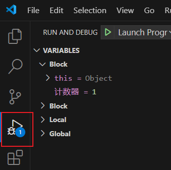

# Developing Automation Flows with JS Scripts

JavaScript is one of the most popular scripting languages on the internet, present in all web pages. As a C-like language, it has a broad user base and is easy to learn.

pbottleRPA automation flow scripts only use the most basic parts of JavaScript. Users with any programming experience are recommended to start developing their flows directly, without the need to study JavaScript in depth first.


## Recommended Editor

VSCode

Download: https://code.visualstudio.com/

## Recommended Version

nodeJS v18 or higher

Download: https://officetool.online/a-316.html


## VSCode Breakpoint Debugging

VSCode provides native breakpoint debugging for JS scripts, allowing you to dynamically observe variable values in real-time and set breakpoints to pause execution.

1. Select the left toolbar -> Run and Debug
2. Select nodejs
3. Click on the line number to set a red breakpoint and run
   
   


## Importing NodeJS Third-Party Modules

npm third-party package library: https://www.npmjs.com/

Any feature module that traditional programming can implement can be integrated into our pbottleRPA automation flows.

For example: file processing, database operations, email sending, etc.

Example of importing nodejs mysql database:

```javascript
// Import pbottleRPA functionality
const pbottleRPA = require('./pbottleRPA')
// Import third-party mysql connection functionality   Pre-execute command: npm install mysql
const mysql      = require('mysql');

var connection = mysql.createConnection({
  host     : 'localhost',
  user     : 'root',
  password : '123456',
  database : 'test'
});
connection.connect();
 
connection.query('SELECT 1 + 1 AS solution', function (error, results, fields) {
  if (error) throw error;
  console.log('The solution is: ', results[0].solution);
  // Use pbottleRPA API
  pbottleRPA.tts("mysql result count: " + results[0].solution)
});
```
