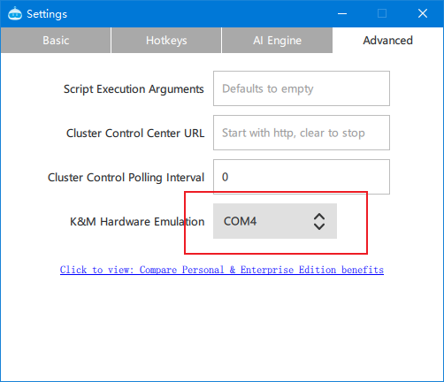
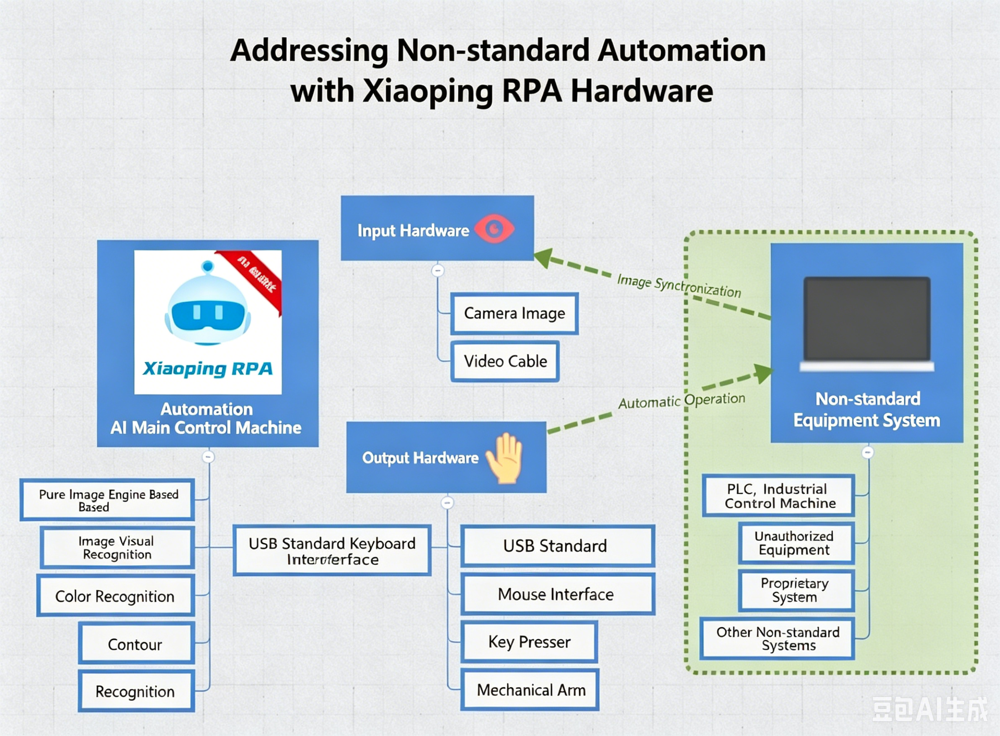

# Hardware Keyboard and Mouse Automation Simulation

⚠ Only available for commercial users.

Most RPA solutions use **software simulation** to control the keyboard and mouse.
Some banking software, U-shield software, financial software, etc., prohibit other software from controlling them for security reasons.
pbottle RPA **hardware keyboard and mouse automation simulation** can solve this problem.

## Hardware Acquisition

- Request the pbottleRPA simulator by mail.
- Computer must have an available USB port.

## Software Configuration

- Menu -> Settings -> Advanced -> Hardware Keyboard/Mouse Simulation.
- After plugging in the device, switch to the current simulator.
- Change the current flow script to the hid scope.

  

See demo example: HID Hardware-Level Keyboard and Mouse Demo.js

## Non-Standard Device Automation

With pbottleRPA hardware-level keyboard input, non-standard device automation can be achieved.

