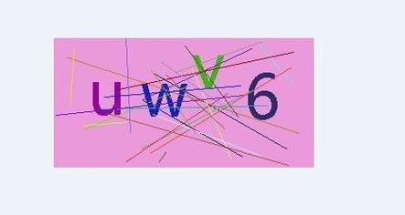

# 验证码自动化

**温馨提示：小瓶RPA本身以模拟操作和数据处理为主，它不具有任何破解功能**

优先选择记住登录状态、U盾、定时刷新等方法保持用户权限的会话。

## 简单图形验证码
   
小瓶RPA文字OCR模块可以解决简单字母数字验证码

## 人工辅助半自动化

流程如下：

1. 小瓶RPA获取验证码截图
2. 发送系统管理员手机，人工识别 
3. 识别结果发送回小瓶RPA自动输入
4. 完成验证！！

*提示：一般系统都有记住登录状态功能，请优先勾选，一台电脑只需登录一次。*

## 用第三方网络API

百度搜索 “验证码识别API”，一般都是些小厂商的api云服务， 注册付费获取api权限并待用

- http://www.ttshitu.com/test.html
- https://www.jfbym.com/price.html

流程：

1. 小瓶RPA获取验证码截图
2. 上传截图到三方API
3. 小瓶RPA根据返回结果生成键鼠逻辑
4. RPA 操作完成验证

## 自有系统私有化部署

小瓶RPA增值服务之一，基于AI图像技术为你独立训练适配当前验证码的本地服务。