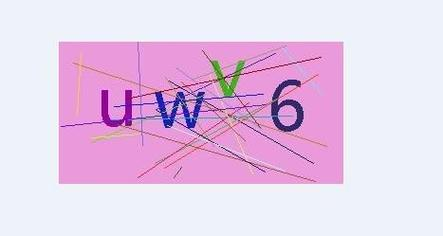

# CAPTCHA Automation

**Friendly reminder: pbottleRPA primarily focuses on simulation operations and data processing. It does not have any cracking capabilities.**

Prefer methods such as maintaining login state, using U-shields, periodic refreshing, etc., to preserve user permission sessions.

## Simple Image CAPTCHA

The pbottleRPA text OCR module can handle simple alphanumeric CAPTCHAs.

## Human-Assisted Semi-Automation

The flow is as follows:

1. pbottleRPA captures the CAPTCHA screenshot.
2. Send it to the system administrator's phone for manual recognition.
3. The recognition result is sent back to pbottleRPA for automatic input.
4. Verification complete!

*Tip: Most systems have a "Remember Login State" feature. Please check this option first — only need to log in once per computer.*

## Using Third-Party Web APIs

Search Baidu for "CAPTCHA recognition API". These are typically API cloud services from small vendors. Register, pay for API access, and use them.

- https://2captcha.com/api-docs
- https://anti-captcha.com/

Flow:

1. pbottleRPA captures the CAPTCHA screenshot.
2. Upload the screenshot to the third-party API.
3. pbottleRPA generates mouse/keyboard logic based on the returned result.
4. RPA completes the verification.

## Private Deployment for Own System

One of pbottleRPA's value-added services — based on AI image technology, independently train a local service adapted to your current CAPTCHA.
